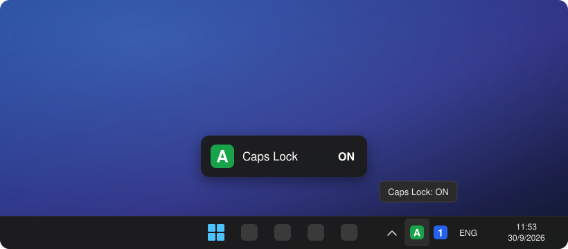
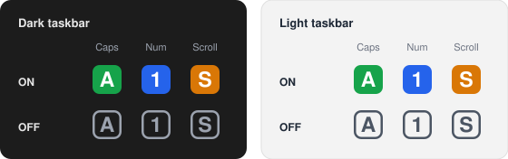

<div align="center">


# LockLights

**A tiny Caps Lock / Num Lock / Scroll Lock indicator for the Windows system tray.**<br>
Many laptops and keyboards have no lock LEDs. This puts them in your tray instead.


<br>

<a href="../../releases/latest/download/LockLights.exe">
  
</a>

<sub>
  Needs the <a href="https://dotnet.microsoft.com/download/dotnet/9.0">.NET 9 Desktop Runtime</a> ·
  No .NET? Get the <a href="../../releases/latest/download/LockLights-standalone.exe">standalone build</a> ·
  <a href="../../releases">All releases</a>
</sub>

<br><br>



</div>

---

## ✨ Features

- 🟢 **A separate tray icon for each lock key**: **A** for Caps Lock, **1** for Num Lock, and **S** for Scroll Lock (off by default)
- 💬 **On-screen popup** when a key changes. It never takes focus and clicks pass through it
- 🖱️ **Left-click an icon** to toggle that key
- 🌗 **Follows your theme** (light or dark taskbar) and stays sharp at any DPI / display scaling
- 🚀 **Start with Windows** in one click, with no installer and no admin rights
- 🪶 **Tiny and light**: one ~200 KB exe, uses almost no CPU, and never logs or hooks your keystrokes

<div align="center">

</div>

## 📦 Installation

1. Download **[LockLights.exe](../../releases/latest/download/LockLights.exe)**.
2. Put it somewhere permanent, e.g. `%LOCALAPPDATA%\LockLights\`.
3. Run it. Right-click a tray icon and turn on **Start with Windows** if you want it to launch at logon.

> [!TIP]
> **Windows 11 hides new tray icons** behind the `^` arrow.
> Drag them onto the taskbar, or open **Settings → Personalization → Taskbar → Other system tray icons** and turn on *LockLights*.

> [!NOTE]
> The downloads aren't code-signed, so Windows SmartScreen may warn you the first time.
> Click **More info → Run anyway**. You can also check the file against `SHA256SUMS.txt` in the release.

| Download | Size | Requirements |
| --- | --- | --- |
| `LockLights.exe` | ~200 KB | [.NET 9 Desktop Runtime](https://dotnet.microsoft.com/download/dotnet/9.0) (x64) |
| `LockLights-standalone.exe` | ~48 MB | None, the runtime is bundled |

## 🖱️ Usage

| Action | Result |
| --- | --- |
| Look at the tray | Filled icon = **ON**, outlined icon = **OFF** |
| Hover an icon | Tooltip, e.g. `Caps Lock: ON` |
| Left-click an icon | Toggles that lock key |
| Right-click an icon | Menu: choose which keys to show, turn the on-screen popup on/off, Start with Windows, Exit |

Settings are saved per user in `HKCU\Software\LockLights`.

## 🛠️ Build from source

You need the [.NET 9 SDK](https://dotnet.microsoft.com/download/dotnet/9.0).

```powershell
git clone https://github.com/ChatzisE/LockLights.git
cd LockLights

# run it
dotnet run --project src/LockLights

# single-file exe (needs .NET 9 Desktop Runtime) -> .\publish\LockLights.exe
dotnet publish src/LockLights -c Release -r win-x64 --self-contained false -p:PublishSingleFile=true -o publish
```

Or just open `LockLights.sln` in Visual Studio / Rider / VS Code.

### Releasing

Pushing a tag like `v1.0.0` runs the [GitHub Actions workflow](.github/workflows/release.yml). It builds both exes and publishes them as a GitHub Release, so the download button always points to the latest version.

```powershell
git tag v1.0.0
git push origin v1.0.0
```

## 🔍 How it works

```text
src/LockLights/
├── Program.cs              entry point, single-instance guard
├── AppInfo.cs              app name, registry path
├── Strings.cs              all user-visible text
├── Configuration/          UserSettings (registry), StartupRegistration (Run key)
├── Input/                  LockKeyDefinition (Caps/Num/Scroll), Keyboard (read/toggle)
├── Interop/                Win32 P/Invoke, per-monitor DPI
├── Osd/                    OsdWindow: the on-screen popup
├── Rendering/              Theme (all fonts, colors, sizes), KeyBadgeRenderer, WindowsTheme
├── Tray/                   TrayApplicationContext, LockKeyIndicator, TrayMenu
└── Resources/              app.ico
```

- The lock states are checked every 100 ms with `Control.IsKeyLocked`.
- It doesn't use a global keyboard hook. It only reads the lock states, so it never sees what you type.
- Fonts, colors, sizes and timings all live in [`Rendering/Theme.cs`](src/LockLights/Rendering/Theme.cs). Change the look there.
- To add a key or change a glyph, edit [`Input/LockKeyDefinition.cs`](src/LockLights/Input/LockKeyDefinition.cs).

## 🗑️ Uninstall

Right-click the tray icon and choose **Exit**, then delete the exe.
If you turned on *Start with Windows*, turn it off before you delete the exe.
To also remove the saved settings, delete `HKCU\Software\LockLights`.

## 📄 License

[MIT](LICENSE). Do whatever you like with it.
